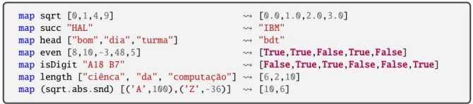

# Haskell

Linguagem funcional pura, fortemente tipada e com inferência de tipos.

## Instalação
### Linux
```bash
apt install haskell-platform
```

### Windows
[Download](https://www.haskell.org/platform/windows.html) do instalador .exe

## Interpretador
```bash
ghci
```
- Interpretador interativo de Haskell que permite a execução de comandos e funções.
- Comandos úteis:
  

## Tipos de Dados
### Caracteres
```haskell
'a' -- Char
```

#### Strings
- Lista de caracteres
```haskell
"Hello" -- [Char]
```

### Números
```haskell
1 -- Int e Integer (inteiro sem limite)
1.0 -- Float e Double
1 % 2 -- Ratio
```

### Listas
```haskell
[1, 2, 3] -- [Int]
[1,2,3,'a'] -- Listas são homogêneas
-- [1,2,3,'a'] -- Erro
```
#### Listas dentro de listas
```haskell
[[1,2],[3,4]] -- [[Int]]
```

#### Funções sobre Listas
- `head` - Retorna o primeiro elemento da lista
- `tail` - Retorna a lista sem o primeiro elemento
- `null` - Verifica se a lista está vazia
- `reverse` - Inverte a lista
- `++` - Concatena duas listas

### Booleanos
```haskell
True -- Bool
False -- Bool
```

#### Funções para trabalhar com booleanos
```haskell
(&&) -- E
(||) -- OU
not -- Negação

-- Estes últimos estão disponíveis no Prelude
```

### Condicionais
```haskell
if 1 == 1 then "Igual" else "Diferente"
-- then e else são obrigatórios
```

## Funções
- Por convenção os arquivos tem extensão `.hs`
- Funções são definidas com `=` e não utilizam parênteses
- Quando não especificamos o tipo da função, Haskell infere o tipo
  - É uma boa prática especificar o tipo das funções
```haskell
-- Função que soma dois números
soma :: Int -> Int -> Int
soma a b = a + b
```

### Condicionais com Guardas
```haskell
-- Função que retorna o maior de dois números
maior :: Int -> Int -> Int
maior a b
  | a > b = a
  | otherwise = b
```

### Definições locais em equações
- `where` é utilizado para definir variáveis locais
```haskell
-- Função que calcula o IMC
imc :: Float -> Float -> String
imc peso altura
  | valor <= 18.5 = "Abaixo do peso"
  | valor <= 25.0 = "Peso normal"
  | valor <= 30.0 = "Sobrepeso"
  | otherwise = "Obesidade"
  where valor = peso / (altura ^ 2)
```
- `let` é utilizado para definir variáveis locais
```haskell
-- Função que calcula área do triangulo
areaTriangulo a b c = let s = (a + b + c) / 2
                          in sqrt (s * (s - a) * (s - b) * (s - c))
```
- Diferença entre `let` e `where`
  - `let` é uma expressão, pode ser utilizada em qualquer lugar
  - `where` é uma definição, deve ser utilizada no final da função (apenas para definições locais)

### Funções com Listas
```haskell
-- Dada uma lista de strings, a função deve retornar a primeira string ou "empty" se a lista for vazia
firstOrEmpty :: [[Char]] -> [Char]
firstOrEmpty lst =  if not (null lst) 
                    then head lst 
                    else "empty"
```

### Entrada e Saída
```haskell
module Main (main) where

main :: IO ()
main = do
  putStrLn "Digite seu nome: "
  nome <- getLine
  putStrLn ("Olá, " ++ nome)
```

```haskell
module Main (main) where

main :: IO ()
main = do putStrLn "Digite um número: "
            n1 <- readLn
            putStrLn "Digite outro número: "
            n2 <- readLn
            putStrLn ("A soma é: " ++ show (n1 + n2))
```

## Tuplas
- Estrutura de dados formada por sequência de valores possivelmente de tipos diferentes
- O tipo de uma tupla é o produto cartesiano dos tipos dos seus componentes
- Não existe tupla de elemento único
```haskell
(1, "Hello") -- (Int, [Char])
```

## ADT - Álgebra de Tipos de Dados
- Dividio em:
  - Um nome para o tipo de seus valores
  - Um conjunto de construtores de valores
- Em um sistema com três tipos de clientes, por exemplo, poderíamos definir um tipo de dados para representar os clientes
```haskell
data Cliente = OrgGov String
             | Empresa String Int String String
             | Individuo Pessoa Bool
             deriving Show

data Pessoa = Pessoa String String
              deriving Show
```

## Type e Newtype
- `type` - Cria um sinônimo para um tipo existente, utilizando os mesmos construtores
```haskell
type Nome = String
type Idade = Int
type CPF = String
type Pessoa = (Nome, Idade, CPF)
```
- `newtype` - Cria um novo tipo, sendo necessário prover construtores
```haskell
newtype Nome = Nome String
newtype Idade = Idade Int
newtype CPF = CPF String
newtype Pessoa = Pessoa (Nome, Idade, CPF)
```

## Pattern Matching
- Permite definir funções de forma mais concisa
- Função para retornar o nome de um cliente
```haskell
nomeCliente :: Cliente -> String
nomeCliente cliente = case cliente of
  OrgGov nome -> nome
  Empresa nome _ _ _ -> nome
  Individuo (Pessoa pNome sNome _) _ -> pNome ++ " " ++ sNome

nomeCliente' :: Cliente -> String
nomeCliente' (OrgGov nome) = nome
nomeCliente' (Empresa nome _ _ _) = nome
nomeCliente' (Individuo (Pessoa pNome sNome _) _) = pNome ++ " " ++ sNome
```

## Funções recursivas
- Dividir o problema em subproblemas menores
- Resolver os subproblemas
- Combinar as soluções dos subproblemas
```haskell
-- Função que calcula o fatorial de um número
fatorial :: Integer -> Integer
fatorial n = if n == 0
              then 1
              else n * fatorial (n - 1)

-- Função que calcula potência de 2
pot2 :: Integer -> Integer
pot2 n
  | n == 0 = 1
  | n > 0 = 2 * pot2 (n - 1)

-- Função de multiplicação
mult :: Int -> Int -> Int
mult _ 0 = 0
mult 0 _ = 0
mult m n = m + mult m (n - 1) 
```

## Valores de Primeira Classe
- Funções que não possuem nome
- Expressão lambda é definida por `\`
```haskell
-- Calcula o triplo de um número
(\x -> 3 * x)
```

## Funções de Alta Ordem
- Possuem função como argumento ou retornam uma função

### Map
- Recebe uma função e uma lista, aplicando a função a cada elemento da lista


### foldl e foldr
- Recebem uma função, um acumulador e uma lista
- Reduzem uma lista a um único valor
```haskell
foldl (+) 0 [1, 2, 3, 4] -- 10
foldr (+) 2 [1, 2, 3, 4] -- 12
```

### Filter
- Recebe uma função e uma lista, retornando uma lista com os elementos que satisfazem a função
```haskell
filter (> 2) [1, 2, 3, 4] -- [3, 4]
filter odd [1, 2, 3, 4] -- [1, 3]
```